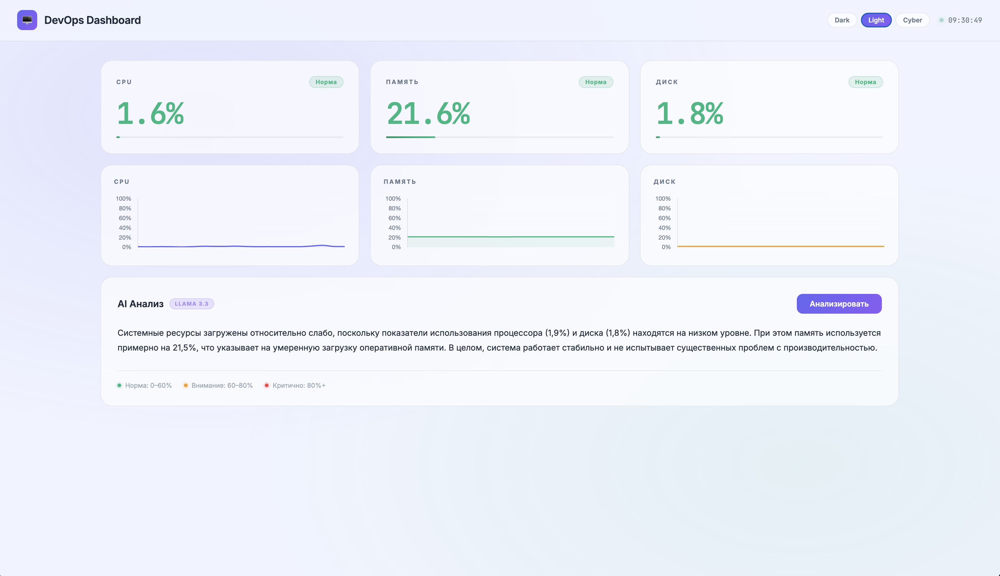

# devops-dashboard


System monitoring dashboard. Tracks CPU, RAM, and disk usage in real time, runs AI analysis on demand, and fires Telegram alerts when something goes critical.

**Live:** https://devops-dashboard-p6n6.onrender.com


## Stack

Python, Flask, psutil, Groq API (LLaMA 3.3), Docker, Kubernetes, Terraform, Render

## Run locally

```bash
git clone https://github.com/boozer23/devops-dashboard.git
cd devops-dashboard
pip install -r requirements.txt
export GROQ_API_KEY=your_key
python app.py
```

Open http://localhost:5002

## Docker

```bash
docker build -t devops-dashboard .
docker run -p 5002:5002 -e GROQ_API_KEY=your_key devops-dashboard
```

## Kubernetes



```bash
# Start Minikube
minikube start

# Build image inside Minikube
eval $(minikube docker-env)
docker build -t devops-dashboard:latest .

# Create secret and deploy
kubectl create secret generic groq-secret --from-literal=api-key=your_key
kubectl apply -f k8s.yml

# Open in browser
minikube service devops-dashboard
```

## Terraform

```bash
cd terraform
terraform init
terraform apply -var="groq_api_key=your_key"
```